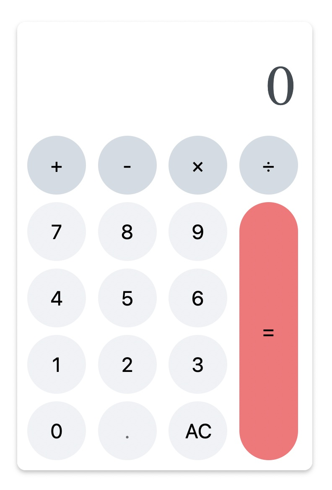

# A simple calculator in Elm that respects operator precedence

A kata for working with Reverse Polish Notation and implementing the Shunting-yard algorithm.

HTML template credits: https://www.cssacademy.com/blog/create-a-calculator-in-html-and-css

## Dependencies

`npm install --global yarn`
`yarn add elm`
`yarn add parcel`

## Installation

`yarn install`

## Run

`npx parcel src/index.html`
